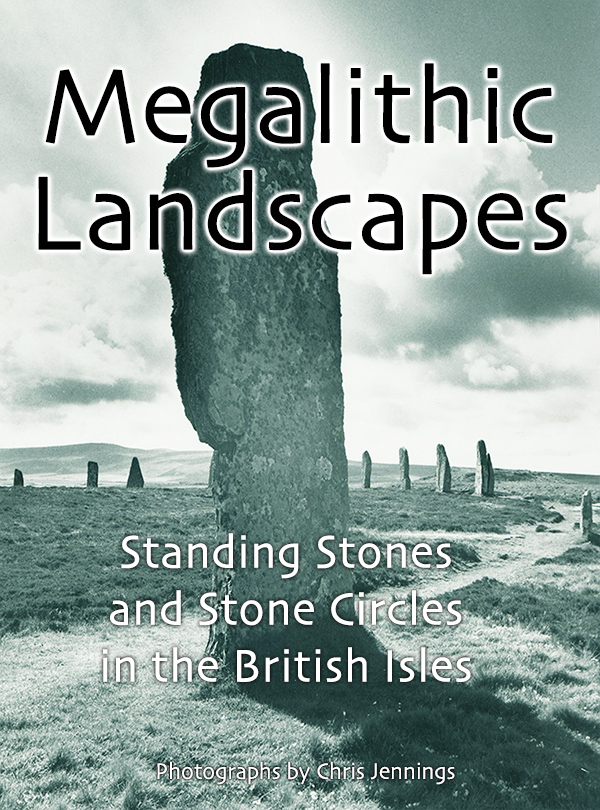

I am looking at my collection of photographs of standing stones and stone circles in the UK.  These photographs were taken as part of a project to document them in the landscape. The photographs were taken between 1973 and 1985.

<!-- more -->

[You can see the complete digital gallery here.](https://www.chrisjennings.net/projects/megalithic-landscapes/)

The photographs were taken with film and eventually scanned for use on the web site. Images are stored on Flickr.

## Where is Ballochroy?

<iframe src="https://www.google.com/maps/embed?pb=!1m18!1m12!1m3!1d16777.91722769101!2d-5.631936631098446!3d55.71043941584671!2m3!1f0!2f0!3f0!3m2!1i1024!2i768!4f13.1!3m3!1m2!1s0x488a1f4c2eabc059%3A0x423e16f41634c36e!2sBallochroy%2C%20Tarbert%20PA29%206XG!5e0!3m2!1sen!2suk!4v1739917612303!5m2!1sen!2suk" width="1500" height="600" style="border:0;" allowfullscreen="" loading="lazy" referrerpolicy="no-referrer-when-downgrade"></iframe>

## eBook available for free!

[You can download my eBook from the Apple Bookstore here.](https://itunes.apple.com/gb/book/megalithic-landscapes/id581000298?mt=11&uo=4)

